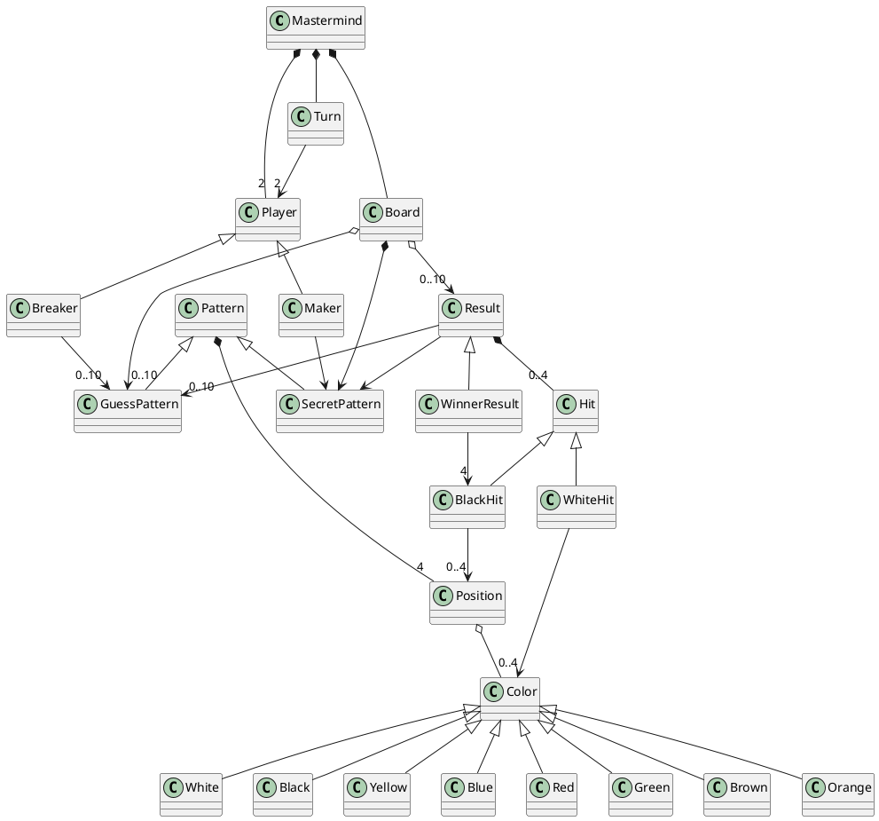

```plantuml
@startuml classDiagram

class Mastermind
class Board
class Turn
class Player
class Result
class Maker
class Breaker
class Pattern
class SecretPattern
class GuessPattern
class Position
class Color
class White
class Black
class Yellow
class Blue
class Red
class Green
class Brown
class Orange
class Hit
class BlackHit
class WhiteHit
class WinnerResult

Mastermind *-- Turn
Mastermind *-- "2" Player
Mastermind *--- Board
Turn --> "2" Player
Player <|-- Maker
Player <|-- Breaker
Pattern <|-- SecretPattern
Pattern <|-- GuessPattern
Pattern *-- "4" Position
Position o-- Color
Color <|-- White
Color <|-- Black
Color <|-- Yellow
Color <|-- Blue
Color <|-- Red
Color <|-- Green
Color <|-- Brown
Color <|-- Orange
Maker --> SecretPattern
Breaker --> "0..10" GuessPattern
Board o--> "0..10" Result
Board *--> SecretPattern
Board o--> "0..10" GuessPattern
Result *-- "0..4" Hit
Result <|-- WinnerResult
Result --> SecretPattern
Result --> "0..10" GuessPattern
Hit <|-- BlackHit
Hit <|- WhiteHit
BlackHit --> "0..4" Position
WhiteHit --> "0..4" Color

WinnerResult --> "4" BlackHit

@enduml
```