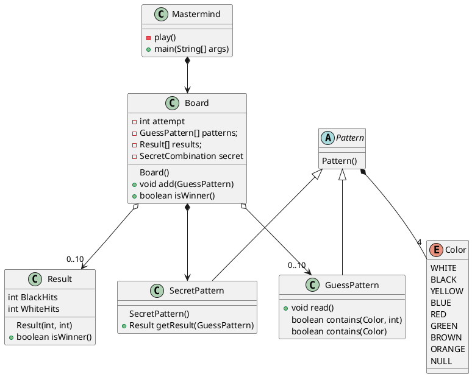

```plantuml
@startuml classDiagram

class Mastermind {
    - play()
    + main(String[] args)
}
class Board {
    -int attempt
    -GuessPattern[] patterns;
    -Result[] results;
    -SecretCombination secret
    Board()
    +void add(GuessPattern)
    +boolean isWinner()
}
class Result {
    int BlackHits
    int WhiteHits
    Result(int, int)
    +boolean isWinner()
}
abstract class Pattern {
    Pattern()
}
class SecretPattern {
    SecretPattern()
    +Result getResult(GuessPattern)
}
class GuessPattern {
    +void read()
    boolean contains(Color, int)
    boolean contains(Color)
}

enum Color {
    WHITE
    BLACK
    YELLOW
    BLUE
    RED
    GREEN
    BROWN
    ORANGE
    NULL
}


Mastermind *--> Board
Pattern <|-- SecretPattern
Pattern <|-- GuessPattern
Pattern *-- "4" Color
Board o--> "0..10" Result
Board *--> SecretPattern
Board o--> "0..10" GuessPattern

@enduml
```